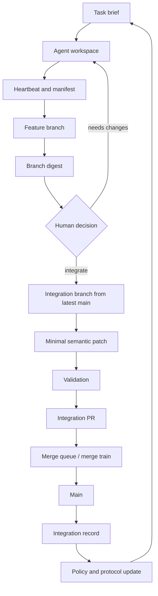

# Architecture

CoProgrammer is a protocol and orchestration layer for semantic integration in
AI-assisted software development.

It does not replace Git, CI, code review, CODEOWNERS, or merge queues. It adds
the missing layer between "many agents produced branches" and "main branch
should receive a small, reviewed, validated patch."

For the persistent control-plane hypothesis, see `docs/MANAGER_PLANE.md`.

## System Boundary

CoProgrammer owns:

- collaboration protocol artifacts;
- machine-readable project policy;
- persistent Manager Plane state;
- branch digest generation;
- integration planning;
- agent telemetry ingestion;
- future semantic patch reconstruction.

CoProgrammer delegates:

- source control to Git;
- identity and review UI to GitHub/GitLab;
- final merge ordering to merge queues or merge trains;
- correctness checks to CI and test suites;
- final architectural decisions to human maintainers.

## Planes

### 1. Protocol Plane

Purpose: define what must stay stable.

Artifacts:

- `protocols/main-branch-constitution.md`
- `protocols/agent-workspace-contract.md`
- `.coprogrammer.json`
- `CODEOWNERS`
- PR and task templates

Responsibilities:

- protected paths;
- ownership;
- default language;
- risk policy;
- contract-first rules;
- allowed and forbidden agent behavior.

### 2. Collaboration Telemetry Plane

Purpose: reduce integration surprises before PR time.

Artifacts:

- task brief;
- agent heartbeat;
- change manifest;
- contract board entries;
- insight log.

Responsibilities:

- show which agent is editing which area;
- record contract changes early;
- expose blockers and experiments;
- forecast path and contract collisions.

### 3. Branch Intelligence Plane

Purpose: convert a branch into a reviewable decision artifact.

Components:

- diff collector;
- commit collector;
- policy loader;
- protected-path matcher;
- risk scorer;
- branch digest renderer;
- future AI intent extractor.

Current implementation:

- `coprogrammer digest`
- `.github/workflows/pr-digest.yml`
- `.coprogrammer.json`

Outputs:

- branch intent placeholder;
- core contribution placeholder;
- changed files;
- commit summary;
- contract and architecture signals;
- risk level;
- protected path matches;
- integration plan placeholder;
- human decision list.

### 4. Semantic Integration Plane

Purpose: rebuild the useful part of a branch from latest main.

Future components:

- integration plan validator;
- source-branch evidence reader;
- minimal patch generator;
- validation runner;
- integration PR publisher;
- integration record writer.

Key rule:

> The source branch is evidence. The integration branch is the thing that may
> merge.

This keeps noisy AI-generated diffs from becoming the merge unit.

### 5. Feedback Plane

Purpose: turn integration lessons into better protocol.

Future artifacts:

- integration record;
- rejected-noise catalog;
- recurring-risk report;
- protocol update proposal.

Responsibilities:

- record why a patch was integrated or rejected;
- update protected paths;
- add missing contract tests;
- improve task templates and agent rules.

## Data Artifacts

| Artifact | Producer | Consumer | Status |
| --- | --- | --- | --- |
| Project policy | Maintainer | CLI, GitHub Action, future bot | Implemented |
| Task brief | Human or orchestrator | Agent | Template |
| Agent heartbeat | Agent | Orchestrator, reviewer | Template |
| Change manifest | Agent | Digest bot, reviewer | Template and validator |
| Branch digest | CLI or PR workflow | Reviewer, integration agent | Implemented |
| Integration plan | Reviewer or bot | Integration agent | Template |
| Integration record | Future bot | Maintainer, protocol updater | Schema and template |
| Research lead | Maintainer or community | Research discussion, roadmap | Schema and seed data |
| Manager event | Agent, bot, or action | Manager Plane | Schema and template |
| Workspace lease | Agent or maintainer | Manager Plane | Schema and template |
| Decision record | Maintainer or advisor | Manager Plane | Schema and template |

## Control Flow



## Current Runtime Architecture

```text
GitHub PR
   |
   v
.github/workflows/pr-digest.yml
   |
   v
coprogrammer digest
   |
   +-- git diff / git log
   +-- .coprogrammer.json
   +-- risk pattern rules
   |
   v
branch-digest.md artifact
   |
   v
coprogrammer github-comment
   |
   v
stable PR comment
```

## Trust Model

CoProgrammer should remain conservative:

- never auto-approve;
- never silently bypass CODEOWNERS;
- never merge protected-path changes without explicit review;
- never treat AI output as trusted just because tests pass;
- prefer human decisions for architecture, security, payment, auth, data
  contracts, and migrations.

## Next Architecture Milestones

1. **Manifest-aware digest**: read agent change manifests and prefill digest
   intent/core contribution sections.
2. **Policy gates**: optionally fail PR checks when high-risk protected paths
   lack manifests or owner review.
3. **Discussion-backed research loop**: keep tool scans, architecture debates,
   and reusable small-feature leads in Discussions before turning them into
   executable issues.
4. **Manager Plane MVP**: introduce a persistent state store for heartbeats,
   leases, contract board entries, and decision requests.
5. **Telemetry store**: collect agent heartbeats during development and surface
   conflict forecasts before PR creation.
6. **Integration record writer**: write the record automatically from an
   integration PR after validation.
7. **Integration Patch Bot**: create a fresh branch from latest main and rebuild
   the minimal patch after human approval.
